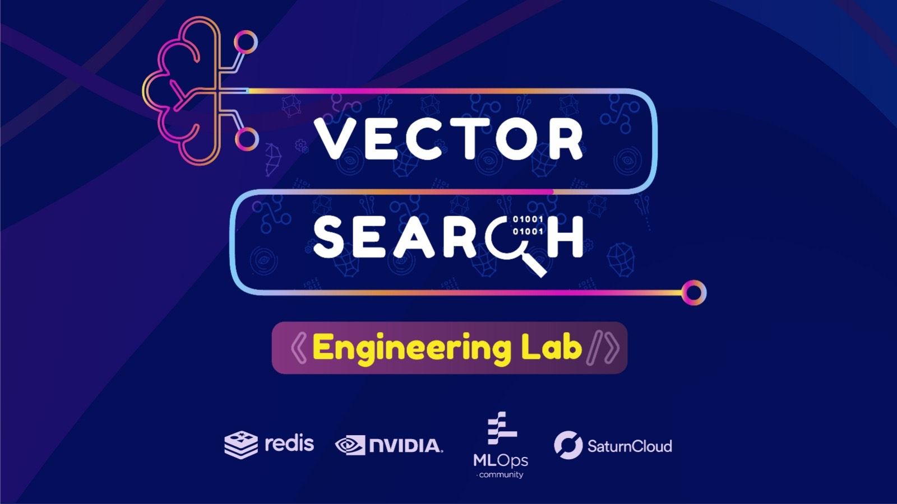
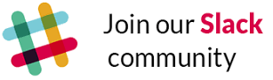

<head>
  <link rel="icon" type="image/png" href="./favicon.png">
</head>

## Overview
#### October 24 2022 - November 4 2022

[Redis](https://redis.io/), [MLOps Community](https://mlops.community/), and [Saturn Cloud](https://saturncloud.io/) are collaborating to host an Engineering Lab (Hackathon) centered on **Vector Search** with the [arXiv scholarly papers](https://arxiv.org/) dataset.

Teams will leverage tools & techniques including:
- **Vector Similarity Search**
- **NLP**
- **Text Mining**
- **Knowledge Graphs**
- **Document Retrieval**
- **Topic Identification**
- **Question & Answering**
- **Recommendation Systems**
- **Data Visualization**

in order to produce a data product that creates value from the arXiv papers datasets and Redis as an in-memory vector database.

### Why Join?
>Take part in the **future**. Get ahead of the field. Learn new and emerging techniques in the areas of embedding creation and vector based search, win cool prizes, and meet awesome folks! Plus -- we've made it painfully easy to get started. **What's not to love?!**

____

## Getting Started

### ✍️ Sign Up
Sign up as team of up to 4 participants.

<a href="https://forms.gle/76aqPeRM43L3ZRru7" target="_blank" rel="noopener">
  <button style="color:white; cursor:pointer; font-size:14px; margin-bottom:8px; border-radius:10px; padding:8px; background-color:#19106b; border:0px">SIGN UP</button>
</a>

### 💻 Join Our Slack
Use this space for collaboration, team creation, or extra help/resources. All announcements will be made through our Slack channel!

### 🤝🏽 Don't Have a Team?
1. Sign up and join our [Slack](#join-our-slack).
2. Find team maes:
    1. Use slack channel to connect with others.
    2. Join a team organizing session - details forthcoming.
3. Finalize team members by **Thursday October 20 2022** and share the name and members in Slack.

### 💪 Prepare for Kickoff
- Read about [submissions](submissions.md) and what to expect.
- Understand the hackathon [timeline](timeline.md).
- Checkout provided [resources](resources.md) and get ready to roll.
- See our "[rules of engagement](rules.md)".

____
