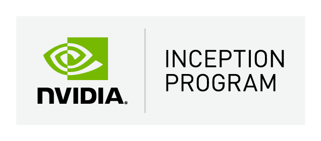

# Overview
### October 24 2022 - November 4 2022

[Redis](https://redis.io/), [MLOps Community](https://mlops.community/), [NVIDIA Inception](https://www.nvidia.com/en-us/startups/), and [Saturn Cloud](https://saturncloud.io/) are collaborating to host an Engineering Lab (Hackathon) centered on **Vector Search** using the [arXiv scholarly papers](https://arxiv.org/) dataset.

Teams will leverage tools & techniques including:
- **Vector Similarity Search**
- **NLP**
- **Text Mining**
- **Knowledge Graphs**
- **Document Retrieval**
- **Topic Identification**
- **Question & Answering**
- **Recommendation Systems**
- **Data Visualization**

in order to produce a data product that creates value from the arXiv papers datasets and Redis as an in-memory vector database.

## Why Join?
>Take part in the **future**. Get ahead of the field. Learn new and emerging techniques in the areas of embedding creation and vector based search, win cool prizes, and meet awesome folks! Plus -- we've made it painfully easy to get started. **What's not to love?!**

## 🏆 Prizes
Top teams have the chance to win **cash prizes**, an **NVIDIA 3080 Ti GPU**, Redis swag, and the opportunity to present at a local MLOps Community meetup!! [Check out the full list](submissions.md).

____

# Getting Started

## ✍️ Sign Up
Sign up as team of up to 4 participants.

<a href="https://forms.gle/76aqPeRM43L3ZRru7" target="_blank" rel="noopener">
  <button style="color:white; cursor:pointer; font-size:14px; margin-bottom:8px; border-radius:10px; padding:8px; background-color:#19106b; border:0px">SIGN UP</button>
</a>

## 💻 Join Our Slack
This will be our primary source of communication during the hackathon. Please join! Use this space for collaboration, team creation, or extra help/resources. All important announcements will be here.

>**Join the #engineeringlabs channel!**

## 🤝🏽 Don't Have a Team?
1. Sign up and join our [Slack](https://join.slack.com/t/mlops-community/shared_invite/zt-1cjmjku5d-ZhJitSlS0VtqfCcwRpn_CQ) in the #engineeringlabs channel.
2. Find team mates by connecting with others in that space.

>Having a team (up to 4 people) will give you a competitive advantage. So, YES, it's probably worth it.

## 💪 Things You'll Need
- Read about [submissions](submissions.md) and what to expect.
- Understand the hackathon [timeline](timeline.md).
- Checkout provided [resources](resources.md) and get ready to roll.
- See our "[rules of engagement](rules.md)".

____

### NVIDIA Inception

We're thrilled to have NVIDIA's Inception program at the table to help assist with teams and startup companies interested in leveraging the full-spectrum of offerings from NVIDIA.

>[Learn more](https://www.nvidia.com/en-us/startups/). Get access to premium NVIDIA hardware, experts, co-marketing support, and the best technical tools / resources to accelerate your startup's mission.